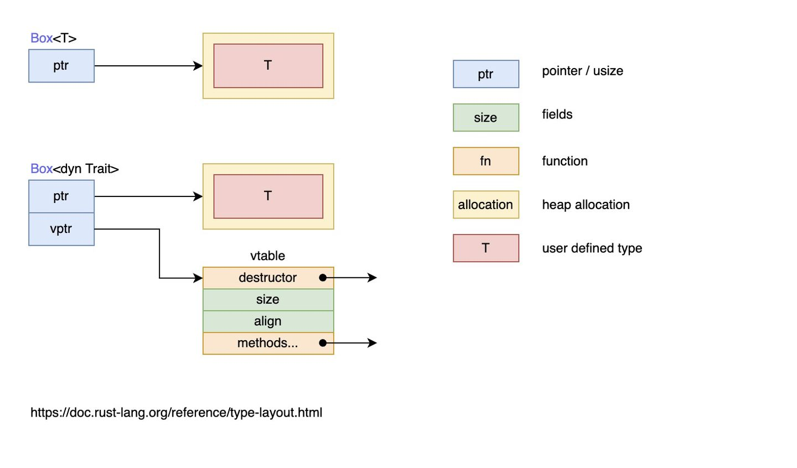

在上一节中有一段代码无法通过边缘：

```rust
fn returns_summarizable(switch: bool) -> impl Summary {
    if switch {
        Post {
            // ...
        }
    } else {
        Weibo {
            // ...
        }
    }
}
```

其中Post和Weibo都实现了`Summary` 特征，因此上面的函数试图通过返回 impl Summary 来返回这两个类型，但是编译器却无情地报错了，原因是 `impl Trait` 的返回值类型并不支持多种不同的类型返回，那如果我们想返回多种类型，该怎么办？

再来考虑一个问题：现在在做一款游戏，需要将多个对象渲染在屏幕上，这些对象属于不同的类型，存储在列表中，渲染的时候，需要循环该列表并顺序渲染每个对象，在 Rust 中该怎么实现？

使用枚举

```rust
#[derive(Debug)]
enum UiObject {
    Button,
    SelectBox,
}

fn main() {
    let object = [
        UiObject::Button,
        UiObject::SelectBox
    ];

    for o in object {
        draw(o)
    }
}

fn draw(o: UiObject) {
    println!("{:?}", o);
}
```

问题，如果对象集合并不能事先明确的知道？缺失或想要新增枚举类型？

我们无法知道所有的UI对象类型，只是知道：

- UI对象的类型不同
- 需要一个统一的类型来处理这些对象，无论是作为函数参数还是作为列表中的一员
- 需要对每个对象调用draw方法

在拥有继承的语言中，可定义一个名为Component的类，该类上有一个draw方法。其他的类比如Button、Image和SelectBox会从Component派生并因此继承draw方法。它们各自都可以覆盖draw方法来定义自己的行为，但是框架会把所有这些类型当作是Component的实例，并在其上调用draw。不过Rust并没有继承。

## 特征对象定义

为了解决上面的所有问题，Rust引入了一个概念--特征对象。
先定义一个特征

```rust
pub trait Draw {
    fn draw(&self);
}
```

只要实现了Draw特征，就可以调用draw方法来进行渲染。假设有个Button和SelectBox组件实现了Draw特征：

```rust
pub struct Button {
    pub width: u32,
    pub height: u32,
    pub label: String,
}

impl Draw for Button {
    fn draw(&self) {
        // 绘制按钮代码
    }
}

struct SelectBox {
    width: u32,
    height: u32,
    options: Vec<String>,
}

impl Draw for SelectBox {
    fn draw(&self) {
        // 绘制SelectBox的代码
    }
}

//需要一个动态数组来存储这些UI对象
pub struct Screen {
    pub components: Vec<?>
}
```

代码中的`?`: 可以替换为Draw的特征对象，通过`&`引用或者`Box<T>`智能指针的方式来创建特征对象。

tips: `Box<T>`包裹的值会被强制分配在堆上

```rust
trait Draw {
    fn draw(&self)->String;
}

impl Draw for u8 {
    fn draw(&self) -> String {
        format!("u8: {}", *self)
    }
}

impl Draw for f64 {
    fn draw(&self) -> String {
        format!("f64: {}", *self)
    }
}

// 若 T 实现了Draw特征，则调用该函数时传入的Box<T>可以被隐式转换成函数参数签名中的Box<dyn Draw>
fn draw1(x: Box<dyn Draw>) {
    // 由于实现了 Deref特征，Box智能指针会自动解引用为它所包裹的值，然后调用该值对应的类型上定义的`draw`方法
    x.draw();
}

fn draw2(x: &dyn Draw) {
    x.draw();
}

fn main {
    let x = 1.1f64;
    let y = 8u8;
    
    // x和y的类型T都实现了`Draw`特征，因为Box<T>可以在函数调用时隐式地被转换为特征对象 Box<dyn Draw>
    // 基于x的值创建一个Box<f64>类型的智能指针，指针指向的数据被放置在了堆上
    draw1(Box::new(x));
    // 基于 y 的值创建一个 Box<u8> 类型的智能指针
    draw1(Box::new(y));
    draw2(&x);
    draw2(&y);
}
```

- draw1 函数的参数是 `Box<dyn Draw>` 形式的特征对象，该特征对象是通过 `Box::new(x)` 的方式创建的
- draw2 函数的参数是 `&dyn Draw`形式的特征对象，该特征对象是通过 `&x` 的方式创建的
- dyn 关键字只用在特征对象的类型声明上，在创建时无需使用 dyn

因此，可以使用特征对象来代表泛型或具体的类型。

```rust
pub struct Screen {
    pub components: Vec<Box<dyn Draw>>,
}
```

其中存储了一个动态数组，里面元素的类型是 Draw 特征对象：`Box<dyn Draw>`，任何实现了 Draw 特征的类型，都可以存放其中。

再来为 Screen 定义 run 方法，用于将列表中的 UI 组件渲染在屏幕上：

```rust
impl Screen {
    pub fn run(&self) {
        for component in self.components.iter() {
            component.draw();
        }
    }
}
```

在列表中存储多种不同类型的实例，然后将它们使用同一个方法逐一渲染在屏幕上！

泛型实现:

```rust
pub struct Screen<T: Draw> {
    pub components: Vec<T>,
}

impl<T> Screen<T>
    where T: Draw {
    pub fn run(&self) {
        for component in self.components.iter() {
            component.draw();
        }
    }
}

```

上面的Screen的列表中，存储了类型为T的元素，然后在Screen中使用特征约束让T实现了Draw特征，进而可以调用draw方法。

这种写法限制了Screen实例的`Vec<T>`中每个元素必须时Button类型或者全是SelectBox类型。如果只需要相同类型集合，更倾向于采用泛型+特征约束这种写法，因为这样实现更清晰，性能更好。（特征对象需要在运行时从vtable动态查找需要调用的方法）

运行

```rust
fn main() {
    let screen =Screen {
        components: vec![
            Box::new(SelectBox{
                width:75,
                height:10,
                options:vec![
                    String::from("Yes"),
                    String::from("Maybe"),
                    String::from("No")
                ],
            }),
            Box::new(Button {
                width: 50,
                height: 10,
                label: String::from("OK",)
            }),
        ],
    };

    screen.run();
}
```

上面使用 Box::new(T) 的方式来创建了两个 `Box<dyn Draw>` 特征对象，如果以后还需要增加一个 UI 组件，那么让该组件实现 Draw 特征，则可以很轻松的将其渲染在屏幕上，甚至用户可以引入我们的库作为三方库，然后在自己的库中为自己的类型实现 Draw 特征，然后进行渲染。

在动态类型语言中，有一个很重要的概念： *鸭子类型*（duck typing），简单来说，就是只关心值长啥样，而不关心它实际是什么。当一个东西走起来像鸭子，叫起来像鸭子，那么它就是一只鸭子，就算它实际上是一个奥特曼，也不重要，我们就当它是鸭子。

使用特征对象和Rust类型系统来进行类似鸭子类型操作的优势是，无需在运行时检查一个值是否实现了特定方法或者担心在调用时因为值没有实现方法而产生错误。如果值没有实现特征对象所需的特征，那么Rust根本就不会编译这些代码。

```rust
fn main() {
    let screen = Screen {
        components: vec!{
            Box::new(String::from("Hi")),
        },
    };
}
```

因为String类型没有实现Draw特征，编译器直接就会报错，不会让上述代码运行。如果想要String类型被渲染在屏幕上，只需要为其实现Draw特征即可。

注意dyn不能单独作为特征对象的定义。特征对象可以是任意实现了每个特征的类型，编译器在编译期间不知道该类型的大小。不同类型的大小是不同的。

&dyn 和 Box<dyn> 在编译期都是已知大小。

```rust
fn draw2(x: dyn Draw) {
    x.draw();
}

10 | fn draw2(x: dyn Draw) {
   |          ^ doesn't have a size known at compile-time
   |
   = help: the trait `Sized` is not implemented for `(dyn Draw + 'static)`
help: function arguments must have a statically known size, borrowed types always have a known size
```

## 特征对象的动态分发

泛型是在编译期完成处理的：编译器会为每一个泛型参数对应的具体类型生成一份代码，这种方式是静态分发(static dispatch)，因为是在编译期完成的，对于运行期性能完全没有任何影响。

与静态分发相对应的是动态分发(dynamic dispatch)，在这种情况下，直到运行时，才能确定需要调用什么方法。之前代码中的关键字 dyn 正是在强调这一“动态”的特点。

当使用特征对象时，Rust 必须使用动态分发。编译器无法知晓所有可能用于特征对象代码的类型，所以它也不知道应该调用哪个类型的哪个方法实现。为此，Rust 在运行时使用特征对象中的指针来知晓需要调用哪个方法。动态分发也阻止编译器有选择的内联方法代码，这会相应的禁用一些优化。

下面这张图很好的解释了静态分发 Box<T> 和动态分发 Box<dyn Trait> 的区别：



- 特征对象大小不固定：这是因为，对于特征 Draw，类型 Button 可以实现特征 Draw，类型 SelectBox 也可以实现特征 Draw，因此特征没有固定大小
- 几乎总是使用特征对象的引用方式，如 `&dyn Draw`、`Box<dyn Draw>`
  - 虽然特征对象没有固定大小，但它的引用类型的大小是固定的，它由两个指针组成（ptr 和 vptr），因此占用两个指针大小
  - 一个指针 ptr 指向实现了特征 Draw 的具体类型的实例，也就是当作特征 Draw 来用的类型的实例，比如类型 Button 的实例、类型 SelectBox 的实例
  - 另一个指针 vptr 指向一个虚表 vtable，vtable 中保存了类型 Button 或类型 SelectBox 的实例对于可以调用的实现于特征 Draw 的方法。当调用方法时，直接从 vtable 中找到方法并调用。之所以要使用一个 vtable 来保存各实例的方法，是因为实现了特征 Draw 的类型有多种，这些类型拥有的方法各不相同，当将这些类型的实例都当作特征 Draw 来使用时(此时，它们全都看作是特征 Draw 类型的实例)，有必要区分这些实例各自有哪些方法可调用

简而言之，当类型 Button 实现了特征 Draw 时，类型 Button 的实例对象 btn 可以当作特征 Draw 的特征对象类型来使用，btn 中保存了作为特征对象的数据指针（指向类型 Button 的实例数据）和行为指针（指向 vtable）。

一定要注意，此时的 btn 是 Draw 的特征对象的实例，而不再是具体类型 Button 的实例，而且 btn 的 vtable 只包含了实现自特征 Draw 的那些方法（比如 draw），因此 btn 只能调用实现于特征 Draw 的 draw 方法，而不能调用类型 Button 本身实现的方法和类型 Button 实现于其他特征的方法。*也就是说，btn 是哪个特征对象的实例，它的 vtable 中就包含了该特征的方法*。

## Self 与 self

在Rust中,有两个self，一个指代当前的实例对象，一个指代特征或方法类型的别名。

```rust
trait Draw {
    fn draw(&self) -> Self;
}

#[derive(Clone)]
struct Button;
impl Draw for Button {
    fn draw(&self) -> Self {
        return self.clone()
    }
}
